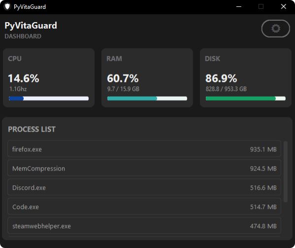
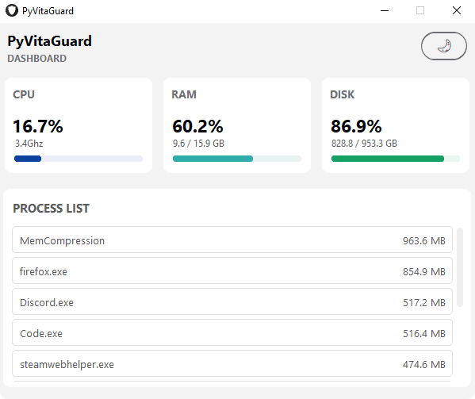

# 🛡️ PyVitaGuard

A Python system monitor that displays CPU, RAM and disk usage alongside the top 10 processes by memory consumption.


## ✨ Features
- Real‑time monitoring of CPU, RAM and Disk usage
- Live percentage updates with progress bars
- Displays CPU frequency (GHz), RAM usage (GB) and Disk usage (GB)
- Process list showing running processes
- Auto‑updates every 2 seconds
- Built with threading to keep the UI responsive

## 📸 Screenshots
 

## 🚀 How to Run

**Option 1 - As Python Script**
```bash
1. pip install -r requirements.txt
2. python PyVitaGuard.py
```

**Option 2 - Standalone Executable**

1. Download the latest `.exe` from [Releases](../../releases) and run it.

## 🛠️ Tech Stack
- Python 3
- CustomTkinter
- psutil
- Standard library (os, sys)

## 📄 License
This project is open source and available under the MIT License.
